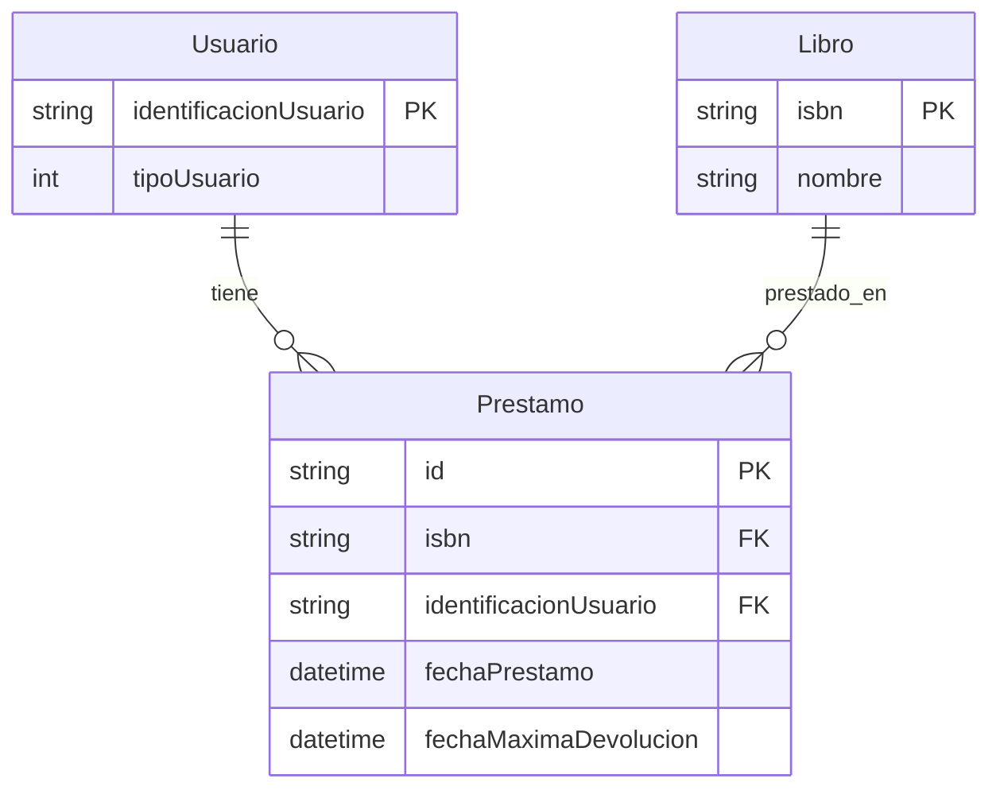

# 🗄️ Diagrama Entidad-Relación - Base de Datos Biblioteca

## Diagrama Visual (Mermaid)



## Descripción de Entidades

### Usuario

Almacena la información de los usuarios del sistema de biblioteca.

| Campo                   | Tipo        | Descripción                                             |
| ----------------------- | ----------- | ------------------------------------------------------- |
| `identificacionUsuario` | String (PK) | Identificación única del usuario (máximo 10 caracteres) |
| `tipoUsuario`           | Integer     | Tipo de usuario: 1=Afiliado, 2=Empleado, 3=Invitado     |

**Relaciones:**

- Un usuario puede tener múltiples préstamos (1:N)

### Libro

Almacena la información de los libros disponibles en la biblioteca.

| Campo    | Tipo        | Descripción          |
| -------- | ----------- | -------------------- |
| `isbn`   | String (PK) | ISBN único del libro |
| `nombre` | String      | Nombre del libro     |

**Relaciones:**

- Un libro puede estar en múltiples préstamos (1:N)

### Prestamo

Tabla de relación que conecta usuarios y libros, almacenando información del préstamo.

| Campo                   | Tipo        | Descripción                                    |
| ----------------------- | ----------- | ---------------------------------------------- |
| `id`                    | String (PK) | ID único del préstamo (UUID)                   |
| `isbn`                  | String (FK) | Referencia al libro prestado                   |
| `identificacionUsuario` | String (FK) | Referencia al usuario que solicita el préstamo |
| `fechaPrestamo`         | DateTime    | Fecha y hora en que se realizó el préstamo     |
| `fechaMaximaDevolucion` | DateTime    | Fecha límite para devolver el libro            |

**Relaciones:**

- Muchos préstamos pertenecen a un usuario (N:1)
- Muchos préstamos pertenecen a un libro (N:1)

## Reglas de Negocio

1. **Tipos de Usuario:**
   - `1` = Afiliado (10 días de préstamo)
   - `2` = Empleado (8 días de préstamo)
   - `3` = Invitado (7 días de préstamo, máximo 1 préstamo activo)

2. **Restricciones:**
   - Los usuarios invitados solo pueden tener 1 préstamo activo a la vez
   - La fecha de préstamo se registra automáticamente
   - La fecha máxima de devolución se calcula según el tipo de usuario

## Esquema Prisma

El esquema completo se encuentra en `prisma/schema.prisma`

```prisma
model Usuario {
  identificacionUsuario String @id @map("identificacion_usuario")
  tipoUsuario           Int    @map("tipo_usuario")
  prestamos             Prestamo[]

  @@map("usuario")
}

model Libro {
  isbn      String @id
  nombre    String @map("nombre_libro")
  prestamos Prestamo[]

  @@map("libro")
}

model Prestamo {
  id                    String   @id @default(uuid())
  isbn                  String
  identificacionUsuario String   @map("identificacion_usuario")
  fechaPrestamo         DateTime @default(now()) @map("fecha_prestamo")
  fechaMaximaDevolucion DateTime @map("fecha_maxima_devolucion")

  libro   Libro   @relation(fields: [isbn], references: [isbn])
  usuario Usuario @relation(fields: [identificacionUsuario], references: [identificacionUsuario])

  @@map("prestamo")
}
```
